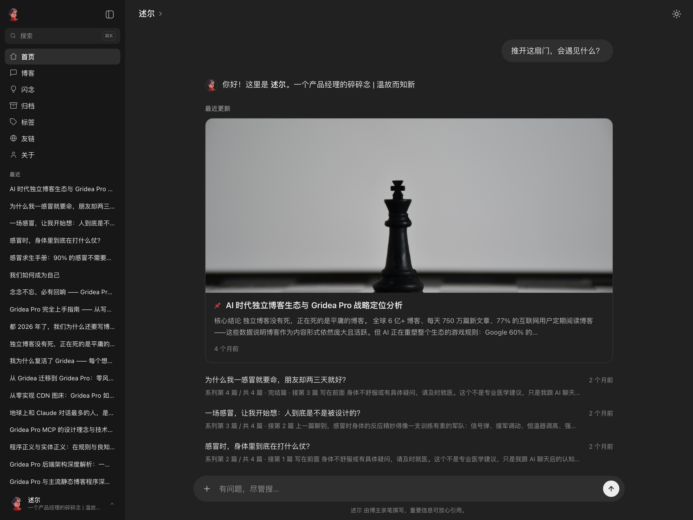
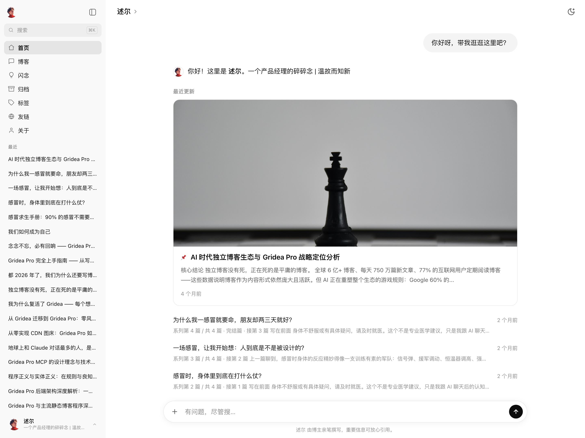

# ChatGPT · Gridea Pro 主题

> 整个博客，就是一场与站长的对话。

**chatgpt** 是 ChatGPT 界面风格的 Gridea Pro 原创对话式博客主题（Jinja2 / Pongo2 引擎）：左侧会话边栏 + 右侧对话流，每个页面都是一轮问答——页面主题以「用户气泡」提问，页面内容以「AI 回复」样式呈现；底部的输入框是真的能用的站内搜索。

| 深色 | 浅色 |
| - | - |
|  |  |

| 项 | 值 |
| - | - |
| 模板引擎 | Jinja2 (Pongo2) |
| 内容宽度 | 768 / 896 / 1024px 三档可调 |
| 外观 | 深浅双模式（跟随系统 / 手动，记住访客选择，无闪屏） |
| 强调色 | 可配置（默认 ChatGPT 绿 `#10a37f`） |
| 依赖 | 零框架、零构建，纯原生 HTML/CSS/JS |
| License | MIT |

## 💬 对话式体验

- **左侧会话边栏**：上半部分是站点导航（按菜单链接自动配图标），「最近」区像 ChatGPT 历史会话一样列出全部文章（`/api/search.json` 动态填充，任何页面可快速跳转），底部站长名片弹出用户菜单
- **右侧对话流**：文章标题就是你的提问，Markdown 正文就是回答；回复下方有仿 ChatGPT 的操作按钮（复制链接 / 复制全文 / 回顶部）
- **对话式搜索**：底部输入框输入关键词回车，问题追加为用户气泡，站内搜索结果以 AI 回复形式出现；另有 ⌘K 弹窗即时搜索
- **对话文案系统**：每个页面的提问与回答文案都可配置多条候选（每行一条），访客每次到访随机展示一条；支持 `{name}` / `{count}` 占位符，未配置时使用内置诗意默认文案
- **开场打字机**：每页开场回答逐字打出、光标闪烁（可关；系统「减弱动态效果」时自动降级为直接显示）

## 🏠 首页内容层次

极简对话开场之下，信息密度可按需分层，全部独立开关：

- **首篇精选卡**：第一篇文章升级为大卡片（封面图 + 两行摘要 + 时间）
- **列表摘要**：「最近更新」每篇标题下一行摘要（优先文章描述，否则取正文开头）
- **手机端导航胶囊**：≤560px 时开场回答下方一行可横滑的导航 pill，不占首屏；宽屏则可选展示建议卡片（默认关）
- **闪念动态**：首页底部追加一组问答，客户端抓取闪念页最新 3 条展示（无闪念菜单自动隐藏）

## 📄 页面

| 页面 | 对话开场 |
|------|----------|
| 首页 | 「推开这扇门，会遇见什么？」+ 精选卡 + 带摘要的最近更新 + 闪念动态 |
| 博客列表 | 「都写过哪些文章？」+ 文章卡片流 + 分页 |
| 文章详情 | 标题气泡 + 正文回复 + 操作按钮 + 作者署名 + 上下篇 + 评论 |
| 归档 | 「时间都去哪儿了？」+ 分类总览 chips + 年份时间线 |
| 闪念 | 「那些一闪而过的念头，你都抓住了吗？」+ 热力图 + 灵感卡片流 |
| 标签 / 标签落地页 | 标签云 chips / 该标签文章列表 |
| 分类落地页 | 该分类文章列表（分类总览见归档页顶部） |
| 友链 | 「在互联网的茫茫人海里，你和谁相遇过？」+ 友链卡片 |
| 关于 | 「屏幕背后的你，是个怎样的人？」+ 关于内容 + 社交按钮 |
| 404 | 「咦，这条路好像走不通了？」+ 引导卡片 |

> Gridea Pro 引擎不生成独立的全站分类索引页（无 `categories.html` 入口），分类总览以归档页顶部 chips 区呈现。

## ✨ 更多特性

- 🌗 **深浅双模式**：跟随系统 / 手动切换，localStorage 记住访客选择，无闪屏；giscus / cusdis / waline 评论主题联动切换
- 🔥 **闪念热力图**：过去一年发布频次，CSS Grid 按容器宽度自适应周数（手机端自动缩短时间窗，绝不横向溢出）
- 💬 **七大评论平台**：Valine / Waline / Twikoo / Gitalk / Giscus / Disqus / Cusdis（走 Gridea Pro 全局评论设置）
- 💻 **代码块增强**：语言标签 + 一键复制 + highlight.js 语法高亮（可关，自动跟随深浅模式）
- 📱 **移动端**：侧边栏抽屉化，布局参考手机版 ChatGPT
- 📐 **侧边栏可收起**（状态记忆）；内容区宽度三档可调
- 🔎 **SEO / GEO**：语义化 HTML + 隐藏 h1；meta / OG / Twitter Card / canonical / BlogPosting JSON-LD 由 Gridea Pro 引擎统一注入（主题不重复输出），主题补充首页 `Blog` 结构化数据（当页文章标题/摘要/日期喂给搜索与生成式引擎）、可见作者署名（`rel="author"`）与「最后更新于」时间

## 🎛️ 主题设置

「主题设置」面板共 7 组：

| 组 | 内容 |
| - | - |
| 基础设置 | 首页最近更新条数、侧边栏「最近」条数、输入框下方小字 |
| 外观设置 | 默认外观（跟随系统/浅/深）、强调色、内容区宽度、回复前头像 |
| 对话文案 · 提问 / 回答 | 每个页面的开场问答文案，多行候选随机展示 |
| 功能开关 | 建议卡片、手机导航胶囊、列表摘要、精选卡、首页闪念、打字机、对话搜索、热力图、代码高亮、RSS |
| 社交链接 | GitHub / Twitter / 邮箱（展示在用户菜单与关于页） |
| 高级设置 | 头部注入代码、自定义 CSS / JS |

> ⚠️ Gridea Pro 对主题 `config.json` 有进程级缓存：更新主题后若设置面板未出现新配置项，重启应用即可。

## 🛠️ 开发备忘

- 模板中 `post.date` 经引擎 JSON 上下文转换后是 **RFC3339 字符串**，不能使用 `|date:` 过滤器；展示日期用 `post.dateFormat`，相对时间用 `post.date|relative`，`datetime` 属性直接输出 `{{ post.date }}`。`now` 是真正的 `time.Time`，可用 `{{ now|date:"2006" }}`。
- Pongo2 中 `not x == y` 会解析成 `(not x) == y`，恒为 false——判断不等请用 `x != y`。
- Pongo2 输出布尔值为大写 `True` / `False`——JS 读取 data 属性判断时先 `toLowerCase()`。
- 归档变量 `archives` 的分组键是大写 `Year` / `Posts`（引擎 struct 未加 json tag）。
- customConfig 的 `type` 只使用 GUI 实际支持的：`input` / `textarea` / `select` / `toggle` / `picture-upload`。
- SEO meta（description / OG / canonical / 文章 JSON-LD）由引擎 HtmlPostProcessor 统一注入，模板侧**不要重复输出**；列表页保留了更精准的页面级 description。
