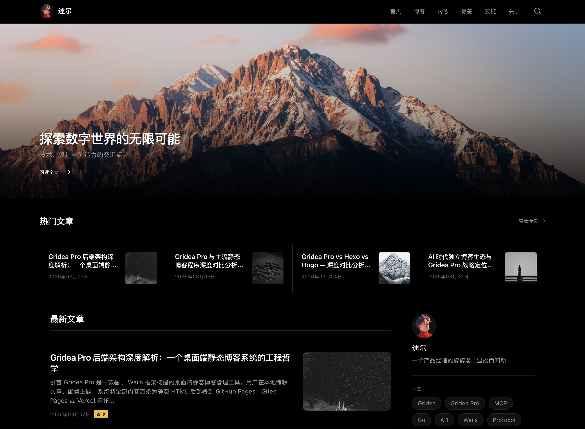

# flavor

> A dark editorial theme inspired by modern newsletter platforms. Features cinematic hero sections, compact post cards, and Spectral serif typography.

## 信息

| 字段 | 值 |
|---|---|
| 目录名 | `flavor-theme` |
| 版本 | `1.0.0` |
| 作者 | Gridea Pro |
| 模板引擎 | `jinja2` |

## 自定义参数

在应用「主题 → 自定义」里可以配置以下选项：

### 侧边栏设置

| 参数 | 说明 | 默认值 |
|---|---|---|
| 侧边栏简介 | - | `` |

### 功能开关

| 参数 | 说明 | 默认值 |
|---|---|---|
| 显示搜索 | - | `true` |
| 显示侧边栏 | - | `true` |
| 显示订阅框 | - | `false` |
| 闪念热力图 | 在闪念页顶部显示过去一年的发布频次热力图 | `true` |

### 基础设置

| 参数 | 说明 | 默认值 |
|---|---|---|
| 站点 Logo | 推荐尺寸 40x40，正方形 | `` |
| 站点文字 Logo | 推荐高度 36px，横向文字标识 | `` |
| 页脚信息 | 支持 HTML | `` |

### 外观设置

| 参数 | 说明 | 默认值 |
|---|---|---|
| 默认主题 | 访客首次访问时默认显示的主题；之后由访客自行切换并记住其选择 | `dark` |
| 主题强调色 | 默认亮黄色 | `#FFFF00` |
| 热力图主色 | 闪念热力图最深色块，其余等级按比例向背景混合 | `#39d353` |

### 社交链接

| 参数 | 说明 | 默认值 |
|---|---|---|
| GitHub | - | `` |
| Twitter/X | - | `` |
| 微博 | - | `` |

### 首页设置

| 参数 | 说明 | 默认值 |
|---|---|---|
| 显示 Hero 区域 | - | `true` |
| Hero 标题 | - | `` |
| Hero 副标题 | - | `` |
| Hero 背景图 | - | `` |
| Hero 链接 | 点击 Hero 跳转的文章链接 | `` |
| 热门文章数量 | - | `12` |

### 高级设置

| 参数 | 说明 | 默认值 |
|---|---|---|
| 自定义 CSS | 追加到主样式后面 | `` |
| 自定义 JavaScript | 追加到页面底部 | `` |

## 使用

1. 在 Gridea Pro 应用内「主题」页选择本主题
2. 在「自定义」里按需调整参数
3. 预览、发布

## 授权

本主题未单独声明 `LICENSE` 文件，按仓库约定视为 **MIT**。

---

*由 [gridea-pro-themes](https://github.com/Gridea-Pro/gridea-pro-themes) 仓库初始化脚本生成。作者可自行修改此 README。*
