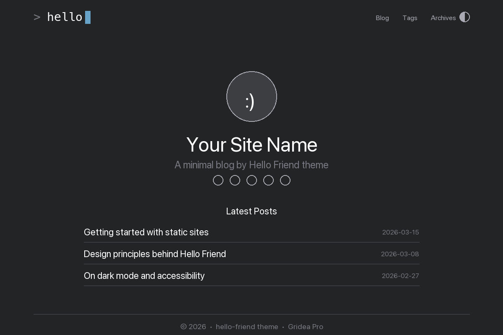

# Hello Friend

> Minimal, clean, personal blog theme with dark/light mode and Inter font. Jinja2 port of the Hugo [hello-friend-ng](https://github.com/rhazdon/hugo-theme-hello-friend-ng) theme by [@rhazdon](https://github.com/rhazdon).



## 特性

- 🌓 **暗色 / 亮色双模式**：跟随系统或用户手动切换，偏好持久化到 localStorage
- ✍️ **个人卡片首页**：头像 + 标题 + 副标题 + 社交链接，下方可选显示最新文章
- 🔤 **Inter 字体**：阅读体验优先，自带 6 个字重（Regular / Italic / Medium / Bold 及各自斜体）
- 💡 **Prism.js 语法高亮**：技术博客友好
- 📱 **完全响应式**：移动端自动切换汉堡菜单
- 🏷️ **标签 + 归档**：按年份分组的归档、标签筛选页、全部标签页
- 🔗 **可配置社交链接**：GitHub / Twitter / LinkedIn / Mastodon / Email / RSS / Telegram / YouTube
- 📤 **可选文章分享按钮**：Twitter / LinkedIn / Email / Telegram / Hacker News
- 🎨 **终端风格 Logo**：可自定义文字、符号、光标颜色、光标动画速度

## 信息

| 字段 | 值 |
|---|---|
| 目录名 | `hello-friend` |
| 版本 | `1.0.0` |
| 原作者 | [Djordje Atlialp (@rhazdon)](https://github.com/rhazdon) |
| Jinja2 移植 | Gridea Pro 社区 |
| 模板引擎 | `jinja2` (Pongo2) |
| 原版授权 | MIT（[LICENSE.md](https://github.com/rhazdon/hugo-theme-hello-friend-ng/blob/master/LICENSE.md)） |

## 页面结构

| 页面 | 说明 |
|---|---|
| `index.html` | 首页：个人卡片（头像 / 标题 / 副标题 / 社交）+ 可选最新文章列表 |
| `blog.html` | 纯文章列表（分页） |
| `archives.html` | 按年份分组的归档 |
| `post.html` | 文章详情（阅读时间 / 字数 / 标签 / 分享按钮） |
| `tag.html` | 单标签筛选 |
| `tags.html` | 全部标签 |
| `404.html` | 错误页，带快捷返回首页和归档 |

## 自定义参数

在 Gridea Pro 应用「主题 → 自定义」里可以配置：

### Logo 设置

- **Favicon**：浏览器标签页图标（推荐 32×32 PNG / ICO）
- **Logo 图片**：上传图片作为 Logo；留空则用文字 Logo
- **Logo 文字** / **Logo 符号** / **Logo 光标颜色** / **Logo 光标动画速度**

### 首页设置

- **首页副标题**：支持 HTML
- **头像路径 / alt 文字 / 最大宽度**
- **首页显示最新文章列表**（关闭后首页仅显示个人卡片）

### 外观

- **启用暗色/亮色切换**
- **默认配色**：跟随系统 / 浅色 / 深色
- **首页背景图**（仅在首页生效）

### 文章

- **显示阅读时间** / **显示字数统计** / **显示文章分享按钮**

### 社交链接（首页显示）

GitHub / Twitter / LinkedIn / Mastodon / Email / RSS / Telegram / YouTube

### 页脚

- **页脚版权声明** / **页脚显示 RSS 图标** / **页脚底部文字**

### 高级

- **自定义 CSS** / **自定义 JavaScript** / **分析代码（原样插入）**

## 跨引擎差异说明

本主题是 Hugo 原版的 **Jinja2 重写版**，并非简单改后缀。主要差异：

- **模板引擎**：Go Template → Pongo2（Jinja2 的 Go 实现）
- **SCSS → CSS**：编译后内置，不依赖 Hugo asset pipeline
- **移除的功能**：多语言切换（flag-icons）、`pagination-single`（文章前后篇，Gridea 无此字段）、分类（Gridea 用标签）、Hugo Git Info、Disqus / Utterances（Gridea 有自己的评论系统）、Mermaid（按需可在"自定义 JS"里加载）
- **i18n**：原版用 Hugo 的 i18n 机制支持 13 种语言；当前版本使用中文硬编码字符串（「较新文章」「较旧文章」「页面未找到」等）以简化实现

## 致谢

- 原版主题：[hugo-theme-hello-friend-ng](https://github.com/rhazdon/hugo-theme-hello-friend-ng) by [@rhazdon](https://github.com/rhazdon)
- 原版灵感来源：[hello-friend](https://github.com/panr/hugo-theme-hello-friend) by [@panr](https://github.com/panr) 和 [hermit](https://github.com/Track3/hermit) by [@Track3](https://github.com/Track3)
- Inter 字体：[Rasmus Andersson](https://rsms.me/about/)
- PrismJS：<https://prismjs.com>

## 授权

本目录下的 Jinja2 模板、CSS、JavaScript 沿用原版的 **MIT** 授权。Inter 字体按 SIL Open Font License 授权。

## 已知限制

- 首页的"最新文章"列表是扁平展示，未按年份分组（`archives.html` 才按年份分组）——避免与归档页重复。如需按年份分组，可调整 `index.html` 使用 ``
- Prism.js 代码高亮需要你在 Markdown 中正确标注代码语言（如 ` ```go`、` ```javascript`），Prism 会自动识别
- 文章详情页的"git 信息"和"多语言翻译列表"已被移除（Gridea 无对应数据源）

## 问题反馈

在 [gridea-pro-themes](https://github.com/Gridea-Pro/gridea-pro-themes/issues) 提 Issue，选「主题 Bug」模板，主题名填 `hello-friend`。
