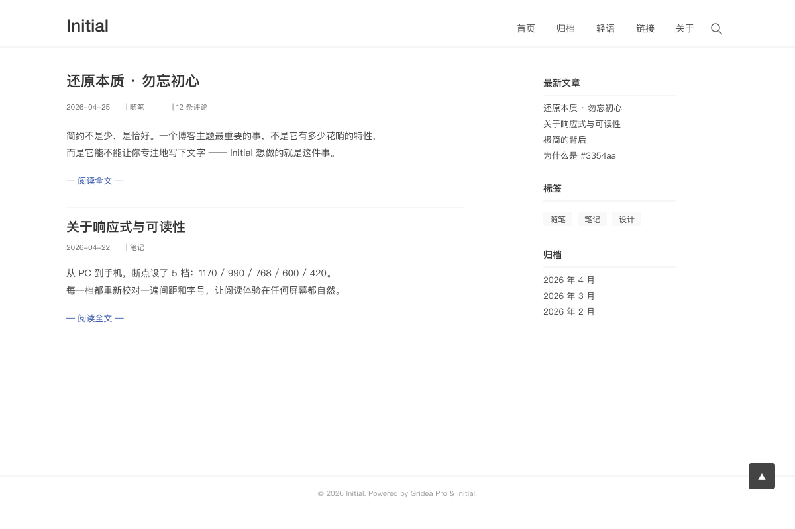

# Initial — Gridea Pro 主题

> **简约而不简单 · 还原本质 · 勿忘初心**
>
> 从 Typecho 主题 [jielive/initial](https://github.com/jielive/initial)（作者 JIElive）100% 视觉移植到 Gridea Pro 的 Jinja2 极简主题。专注于文字。



## 特点

- **极简至上** —— 系统字体栈、文字色 `#444`、链接色 `#3354aa`、几乎无阴影、圆角 2px
- **响应式** —— 5 档断点（1170 / 990 / 768 / 600 / 420），PC 双栏、移动单栏自适应
- **深浅模式** —— 跟随系统 / 始终亮 / 始终暗 / 由读者切换 4 档；防闪暗色
- **全屏搜索** —— 直接 fetch `/api/search.json`，标题 / 标签 / 正文加权评分；快捷键 `/` 或 `Ctrl+K`
- **闪念页 + 热力图** —— 53 周 × 7 天发布密度可视化
- **文章目录** —— 浮动 TOC 面板（可关），滚动高亮当前章节
- **代码块复制按钮** —— hover 显示
- **阅读进度条** —— 顶部 2px 极细
- **上下篇导航** —— 用 Gridea Pro 标准 `post.prevPost / nextPost`
- **评论组件** —— 标准 `#gridea-comments` 挂载点，沿用原主题视觉外壳
- **单栏模式** —— 开关一键切换为正文居中

## 页面与组件

页面：首页 / 博客列表 / 文章详情 / 归档 / 闪念 / 标签列表 / 标签详情 / 分类列表 / 分类详情 / 友链 / 关于 / 404

组件：搜索 modal / 分页 / 上下篇 / memos 热力图 / 评论挂载点 / 面包屑 / 右下浮动小工具

## 关键自定义配置项（节选）

通过 Gridea Pro 客户端的「主题设置」面板配置：

| 分组 | 关键项 |
|------|--------|
| 基础 | 站点副标题 / 标题展示形式 / 头部固定 / 单栏模式 / Favicon |
| 外观 | 深浅模式 / 显示明暗切换按钮 / 正文链接色 / 容器最大宽度 / 显示面包屑 |
| 首页 | 显示缩略图 / 摘要字数 / 显示「阅读全文」 |
| 侧栏 | widgets 勾选 / 最新文章条数 / 标签云上限 / 侧栏固定 |
| 增强 | 返回顶部 / 目录浮动按钮 / 浏览数脚本（不蒜子）/ 文章末尾许可信息 |
| 闪念 | 标题 / 显示热力图 |
| 页脚 | 标语 / ICP / 公安备案 / Powered by / 附加 HTML |
| 高级 | 自定义 CSS / 自定义 head HTML / 自定义 body 末尾 HTML |

## 移植要点（与原 Typecho 版的差异）

| 原行为 | Gridea Pro 移植 |
|--------|----------------|
| Pjax + Ajax 翻页 | 砍，改纯静态 + 标准上一页/下一页 |
| Typecho 评论表单 | 替换为 `#gridea-comments` 标准挂载点 |
| 搜索（form 提交后端） | fetch `/api/search.json` 客户端高亮 |
| 缩略图调用文章第 N 张图 | 用 `post.feature`，无则使用默认封面 SVG |
| 阅读量数据库 | 留 `#busuanzi_value_page_pv` 占位 + 不蒜子开关 |
| 热门文章（按评论数） | 改最新文章 |
| 最近回复 widget | 砍（无后端数据） |
| 文章目录 catalog-col | 用 `post.toc \| safe`，浮动按钮保留 |
| highlight.js CDN | 砍 CDN，沿用原 hljs 配色 CSS |
| 背景音乐播放器 | 砍（极简就该砍） |
| 轻语 page-whisper | Gridea 标准 `memos.html` + 53×7 热力图（新增） |
| 暗色模式 | **新增**——原主题没有，按其极简风格补 |

## 开发与验证

```bash
# 语法验证
python scripts/validate_syntax.py themes/initial

# 渲染测试
python scripts/render_test.py themes/initial
```

当前状态：**0 错误 / 13 模板 全部 PASS**。

## 致谢与许可

- 原 Typecho 主题 © [JIElive](https://github.com/jielive/initial) - https://www.offodd.com/
- 本 Gridea Pro 移植版采用 MIT 协议（与本仓库其他主题一致）

如发现 BUG 或希望追加功能，请在 [Gridea-Pro/gridea-pro-themes](https://github.com/Gridea-Pro/gridea-pro-themes) 提 Issue 或 PR。
