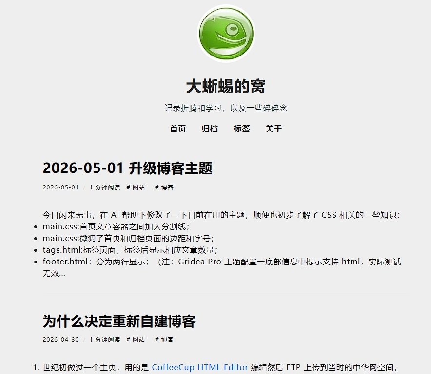

# iNotes-gai

> iNotes 主题改版

## 更新记录

### 1.0.2 (2026-08-17)
- 加入 links.html，让主题可正常显示 Gridea Pro 中定义的友链
### 1.0.1 (2026-08-14)
- post.html:文章页面加入发表时间，方法是在 line 22 `{{.Post.DateFormat}}`后加入`{{.Post.CreatedAt.Format "15:04"}}`。注意两者之间有个空格，否则日期时间会连在一起。存档和文章列表如有需要也可如法炮制。
- 修改了存档页面的日期颜色，视觉更清晰
### 1.0.0 (2026-05-01)
- main.css:首页文章容器之间加入分割线；
- main.css:微调了首页和归档页面的边距和字号；
- tags.html:标签页面，标签后显示相应文章数量；
- footer.html：分为两行显示；
- post.html 及 main.css：原版文章页面底部只有“下一篇”导航，加入了“上一篇”导航。

## 作者

[@fffb](https://github.com/fffb)

## 授权

MIT
