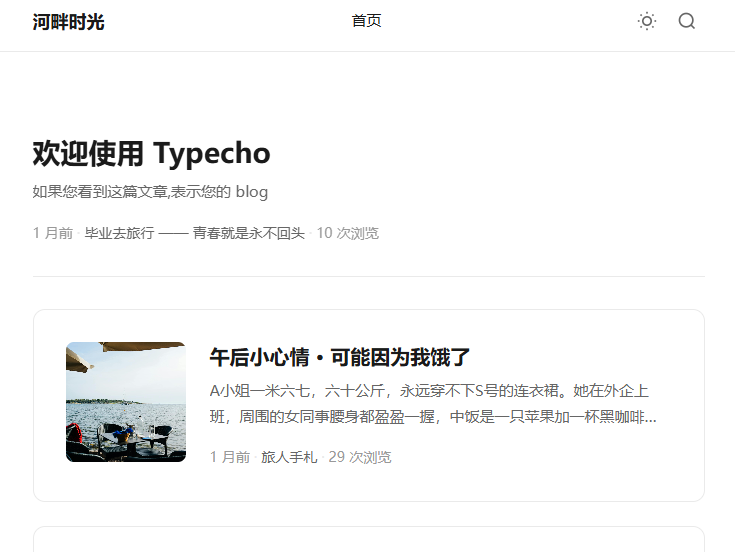

# kehua · 留白主题

> 单栏极简，留白克制。一个写得下长文、放得下闪念的主题。

## 这是什么

`kehua` 是为 [Gridea Pro](https://github.com/Gridea-Pro/gridea-pro) 准备的 Jinja2 (Pongo2) 主题。整体风格借鉴 [刻画 / kehua.me](https://kehua.me) 的 _whitespace_ 设计：单栏、衬线可选、深浅自适应、不堆装饰。

适合：

- 想认真写长文，不想被花里胡哨的卡片打扰
- 把博客 + 闪念碎片放在同一个站点的人
- 喜欢"一打开就是文字"的读者体验

## 主要特性

- **PC + 移动响应**，一套样式两端都顺
- **深 / 浅 / 跟随系统** 三态切换，带 FOUC 防护（不会在白屏里闪一下黑）
- **全站搜索**：`Cmd/Ctrl + K` 唤出，模糊匹配标题 / 摘要 / 标签 / 闪念，本地索引零依赖
- **闪念热力图**：GitHub 风格 365 天网格，按 memo 发布日期密度着色
- **阅读进度条 / 代码块复制 / 回到顶部**：可在主题设置里逐项开关
- **评论挂载点**：复用 Gridea Pro 标准评论服务（Disqus / Gitalk / Waline / Twikoo …），主题不绑定具体方案
- **正文宽度 / 字体 / 主题色** 都能在 GUI 里改，不需要碰代码

## 包含的页面模板

| 模板 | 说明 |
|---|---|
| `index.html` | 首页，含可选 hero 文案 + 置顶推荐 + 文章列表 |
| `post.html` | 文章详情，含上一篇 / 下一篇 |
| `blog.html` | 博客列表（分页） |
| `archives.html` | 按年份分组归档 + 文章 / 标签数量统计 |
| `tags.html` / `tag.html` | 标签云 / 单标签详情 |
| `categories.html` / `category.html` | 分类网格 / 单分类详情 |
| `memos.html` | 闪念时间轴 + 热力图 |
| `about.html` | 关于页（头像 / 简介 / 社交图标） |
| `links.html` | 友情链接卡片 |
| `404.html` | 错误页 |

## 自定义参数

在 Gridea Pro 应用的「主题设置」里改，分组如下：

- **基础设置**：副标题 / 页脚版权 / 是否显示主题署名
- **外观设置**：主题色 / 主题色 hover / 正文最大宽度 / 字体（无衬线 vs 思源宋体）/ 默认配色
- **首页**：是否显示置顶推荐 / hero 文案
- **文章**：阅读进度条 / 代码复制 / 回到顶部
- **搜索**：是否启用全局搜索（关掉就不会注入索引）
- **闪念**：是否显示热力图 / 闪念页标题 / 描述
- **关于页**：自定义头像 / 一句话简介
- **社交**：GitHub / Twitter / RSS / 邮箱
- **评论**：开关 + 占位提示
- **高级**：Head 注入代码 / Footer 注入代码 / 自定义 CSS

完整字段定义见 [`config.json`](./config.json)。

## 安装

1. 把 `themes/kehua/` 整个目录拷到你 Gridea Pro 站点的 `themes/` 下
2. 在应用里选「kehua」主题
3. 改下你想改的颜色 / 副标题 / 社交链接，发布

> 未来 Gridea Pro 会支持应用内一键安装主题，目前先走手动。

## 资源约定

- `assets/styles/main.css` → 渲染后路径 `/styles/main.css`
- `assets/scripts/main.js` → 渲染后路径 `/scripts/main.js`
- `assets/media/images/*` → 渲染后路径 `/media/images/*`
- `assets/media/preview.png` → 主题画廊展示用

如果你想改样式，建议优先用 GUI 里的「自定义 CSS」追加覆盖，不要直接改 `main.css`。

## 关于致谢

设计灵感来自 [刻画 · kehua.me](https://kehua.me)。Gridea Pro Jinja2 移植由 Eric 完成，欢迎 PR / Issue。

## 授权

[MIT](./LICENSE) — 随便用，记得保留版权信息。
