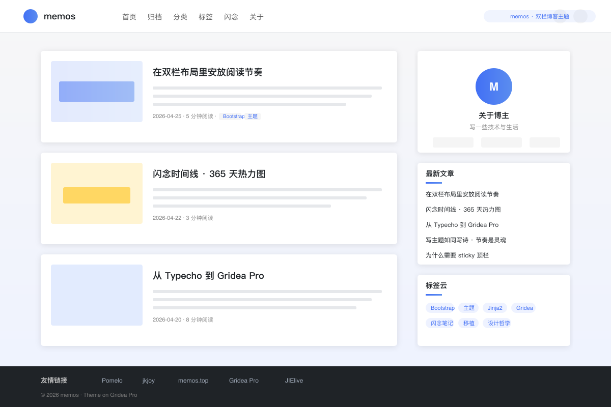

# memos · 双栏博客主题

> Bootstrap 5 风格的双栏博客主题，源自 jkjoy 的 Typecho 主题 Once。带闪念时间线 + 365 天热力图。

## 这是什么

`memos` 是为 [Gridea Pro](https://github.com/Gridea-Pro/gridea-pro) 准备的 Jinja2 (Pongo2) 主题。视觉骨架完整移植自 [jkjoy/Typecho-Theme-Once](https://github.com/jkjoy/Typecho-Theme-Once)（原项目又名"绘主题"，[demo](https://memos.top)）。

整体布局：

- **sticky 顶栏**：logo + 主导航（带分类/页面下拉）+ 主题切换 + 搜索按钮
- **PC 双栏**：主区 9 列（卡片列表 / 文章详情）+ 侧栏 3 列（作者卡 / 最近文章 / 分类导航 / 标签云）
- **移动端**：汉堡菜单 Offcanvas 从左滑入，侧栏栈到主区下方
- **页脚**：深色友链横条 + 版权 + 备案号 + 圆形回到顶部按钮

适合：

- 喜欢 Bootstrap 经典感、不嫌"功能多"的写作者
- 希望博客 + 闪念碎片 + 友链 + 分类都有归宿的人
- 想要"看起来像个正经站"而非极简单页的读者体验

## 主要特性

- **PC + 移动响应**：1200px 内容容器、992px 切汉堡、768px 简化卡片
- **深 / 浅 / 跟随时间** 三态切换，auto 模式按 6:00–18:00 自动调度
- **首页轮播 + 推荐分组**：按 tag 取文章，3 列布局可独立配置
- **多模块侧栏**：作者卡、最近文章、分类导航、标签云，每项可独立开关
- **闪念时间线 + 热力图**：把打了指定 tag 的文章作为闪念展示，GitHub 风格 365 格密度着色
- **全站搜索**：顶栏按钮 + `Cmd/Ctrl+K` 唤出，本地索引，支持标题 / 摘要 / 标签匹配
- **代码块复制 / 图片 lightbox / 表格响应式包裹 / 回到顶部**
- **评论挂载点**：复用 Gridea Pro 标准评论服务（Disqus / Gitalk / Waline / Twikoo / Giscus 任选）
- **可选霞鹜文楷字体**：在主题设置里一键开关，按需加载

## 页面模板

| 模板 | 说明 |
|---|---|
| `index.html` | 首页：轮播 + 推荐分组 + 文章卡片列表 |
| `blog.html` | 博客列表（无轮播，纯卡片 + 分页） |
| `post.html` | 文章详情：标题区 + 正文 + 标签 + 上下篇 + 相关文章 + 评论 |
| `archives.html` | 按年份分组归档 + 数量统计 |
| `memos.html` | 闪念时间线 + 热力图（按 `memosTag` 取） |
| `tags.html` / `tag.html` | 标签云 / 单标签详情 |
| `categories.html` / `category.html` | 分类网格 / 单分类详情 |
| `links.html` | 友情链接卡片墙 |
| `about.html` | 关于页 |
| `404.html` | 错误页（隐藏 header/footer） |

## 自定义参数

在 Gridea Pro 应用的「主题设置」里改，分组：

- **基础设置**：副标题 / 每页文章数 / 页脚版权 / ICP 备案号
- **外观设置**：主题色 / 强调色 / 默认配色（auto/light/dark）/ 霞鹜文楷开关
- **首页设置**：轮播开关 / 轮播来源 tag / 中央推荐 tag / 右侧推荐 tag
- **布局设置**：侧栏开关 / 友链横条开关
- **侧栏模块**：作者卡 / 最近文章 / 分类导航 / 标签云 4 项独立开关 + 数量
- **闪念设置**：闪念 tag / 标题 / 描述 / 热力图开关
- **搜索设置**：全站搜索开关
- **评论设置**：评论容器开关
- **社交设置**：GitHub / Twitter / 微博 / Email / RSS
- **高级设置**：自定义 CSS / Head 注入 / Footer 注入

完整字段定义见 [`config.json`](./config.json)。

## 安装

1. 把 `themes/memos/` 整个目录拷到你 Gridea Pro 站点的 `themes/` 下
2. 在应用里选「memos」主题
3. 改下你想改的颜色 / 副标题 / 社交链接，发布

> 未来 Gridea Pro 会支持应用内一键安装主题，目前先走手动。

## 资源约定

- `assets/styles/main.css` → 渲染后路径 `/styles/main.css`
- `assets/styles/bootstrap.min.css` → `/styles/bootstrap.min.css`
- `assets/styles/bootstrap-icons.css` → `/styles/bootstrap-icons.css`
- `assets/styles/fonts/*.woff2` → `/styles/fonts/*.woff2`
- `assets/scripts/main.js` → `/scripts/main.js`
- `assets/scripts/jquery.min.js` → `/scripts/jquery.min.js`
- `assets/scripts/bootstrap.bundle.min.js` → `/scripts/bootstrap.bundle.min.js`
- `assets/media/images/*` → `/media/images/*`
- `assets/media/preview.png` → 主题画廊展示用

如果你想改样式，建议优先用 GUI 里的「自定义 CSS」追加覆盖，不要直接改 `main.css`。

## 关于"闪念页"和"热力图"

原 Once 主题没有这两项。本主题作为对 Gridea Pro 生态的补全，按 Once 的视觉语言（卡片 + bi 图标 + Bootstrap 网格）新增了 `memos.html`：

- **数据来源**：把要作为闪念展示的短文打上 `memosTag` 配置项指定的标签（默认 `memo`），其它文章不受影响
- **热力图**：客户端读取闪念列表的发布日期，绘制 GitHub 风格 7×52 格 + 5 档颜色
- **关闭方式**：在「闪念设置」里把热力图开关关掉即可

## 关于"加载更多"和"侧栏热评/热门"

原 Once 主题用 Typecho 数据库 SQL 实现了"加载更多 JSON 接口"和"侧栏按浏览数 / 评论数排序"。Gridea Pro 是静态站，**不走那条路**。本主题做了如下降级：

- 加载更多 → 改为传统的"上一页 / 下一页"分页
- 侧栏热评 / 热门 / 最近回复 → 替换为「最近文章 / 分类导航 / 标签云」三个静态友好模块
- 文章浏览数 → 主题不内置统计，建议在「Head 注入代码」里粘贴不蒜子 / Umami / Plausible 的脚本

## 致谢

主题设计 & 灵感：[jkjoy](https://github.com/jkjoy)（原 Typecho 主题 Once / 绘主题，[源仓库](https://github.com/jkjoy/Typecho-Theme-Once)）。
Gridea Pro Jinja2 移植由 Eric 完成，欢迎 PR / Issue。

## 授权

[MIT](./LICENSE) — 随便用，记得保留版权信息。
