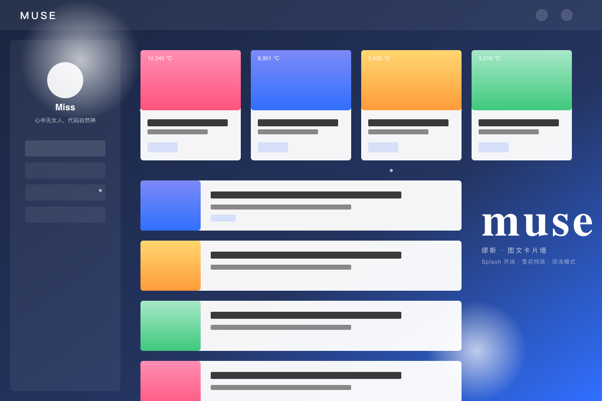

# Muse — 缪斯

> 移植自 Typecho 主题 [Xc-Three](https://www.tmetu.cn)（原作者 Miss）的 Gridea Pro Jinja2 主题。
>
> **Splash 全屏开场 · 左侧栏导航 · 主区图文卡片瀑布墙 · 浮动雪花特效 · 深浅模式自动切换。**



## 设计基因

- **左侧栏布局**：260px 固定左侧栏（博主头像 + 一句话签名 + 主菜单），主区右侧呈现卡片瀑布墙——区别于多数博客的右侧栏布局
- **Splash 全屏开场**：进站时全屏背景图 + 站名 + 副标题，单击或滚轮收起，可设为「每会话仅一次」
- **图文卡片墙**：PC 端 4 列网格（可调 3/4/5），左图右文，封面默认 16:9
- **热度℃ 显示**：首页可选热度榜，封面右上角「12,345 ℃」醒目角标
- **浮动雪花特效**：纯 canvas 实现的小圆点漂落动画，浅色用主题色、深色用白色，可一键关闭
- **深浅双模**：四档（跟随系统 / 始终浅色 / 始终深色 / 由读者切换），CSS 变量平滑过渡，sun/moon 按钮位于顶栏右上角

## 视觉规格

| 项目 | 浅色 | 深色 |
|------|------|------|
| 主题色 | `#306fff` | `#73aaff` |
| 容器宽 | 1500px（PC）/ 100%（≤1199）| 同 |
| 字体 | PingFang SC / Microsoft YaHei / 系统栈 | 同 |
| 文字主色 | `#404044` | `#ccc` |
| 卡片底色 | `rgba(255,255,255,0.94)` | `rgba(35,35,35,0.94)` |
| 圆角 | wrap 6px / inner 4px | 同 |

## 包含页面

| 文件 | 用途 |
|------|------|
| `index.html` | 首页（Swiper 大轮播 + 推荐 + 热度榜 + 卡片网格 + 分页） |
| `blog.html` | 博客列表（与首页同骨架，无 Swiper） |
| `post.html` | 文章详情（标题区 + TOC + 正文 + 上下篇 + 评论） |
| `archives.html` | 时间轴归档（按 `archives` 全局变量分年） |
| `tags.html` | 标签云（彩色椭圆胶囊） |
| `tag.html` | 标签详情落地页（自动按每个 tag.slug 渲染） |
| `category.html` | 分类详情落地页（自动按每个 category.slug 渲染） |
| `memos.html` | 闪念列表 + 53×7 发布热力图 |
| `links.html` | 友情链接卡片网格 |
| `about.html` | 关于页（博主卡 + 站点 + 主题信息） |
| `404.html` | 找不到页面 |

## 包含 partials

`splash.html` / `header.html` / `aside.html` / `footer.html` / `post-card.html` / `pagination.html` / `post-nav.html` / `comments.html` / `heatmap.html`

## 主要 customConfig（共 41 项，分 9 组）

| 组 | 关键项 |
|----|--------|
| 基础 | siteSubTitle / authorName / authorMotto / authorAvatar / favicon / logoLight / logoDark |
| 外观 | themeMode / primaryColor / primaryColorDark / containerWidth / asideWidth / fontFamily |
| Splash 开场 | enableSplash / splashImage / splashOnce |
| 特效 | **enableSnowflake** / snowflakeColor / snowflakeCount |
| 首页 | indexFeaturedTag / indexFeaturedCount / indexHotCount / indexCardCols / showHeatBadge |
| 侧栏菜单 | asideShowGroup |
| 闪念 | memosTitle / memosShowHeatmap |
| 增强 | showReadingProgress / showBackToTop / showCodeCopy / showToc / viewsScript（不蒜子） |
| 页脚 | footerSlogan / footerICP / footerPolice / footerShowPower / footerExtra |
| 高级 | customCSS / customHeadHtml / customBodyEndHtml |

## Splash 背景图与图源接口

原 Xc-Three 演示站使用站主自建的随机图 API：

```
https://www.tmetu.cn/api/img/                    （Splash 全屏）
https://www.tmetu.cn/api/img/720/?token=<post>   （文章封面 720px 宽）
```

由于这是站主私有 API，移植版默认不依赖。**用户可以**：

- 在 customConfig → Splash 背景图 中填入任意公共随机图 API（如 `https://api.dujin.org/bing/1920.php`、`https://source.unsplash.com/1920x1080/?nature`）
- 或上传自己的图片，使用静态 URL
- 如果想保留 tmetu 站接口体验，可填 `https://www.tmetu.cn/api/img/`（但请尊重原站主资源）

## 安装

将 `muse/` 目录放入 Gridea Pro 桌面客户端的 `themes/` 目录下，重启客户端，在「主题」面板选择 Muse。

## 评论组件

主题不内置评论实现，使用 Gridea Pro 标准的 `#gridea-comments` 挂载点——评论平台（Waline / Twikoo / Giscus 等）由 Gridea Pro 全局评论设置注入。

## 暗色模式键

`localStorage` key: `data-night`（值 `night` / `day`），与原 Xc-Three 兼容。`html` 节点的 `data-night="night"` 属性触发暗色样式。

## 雪花特效

`canvas#www_xccx_cc` 全屏背景层，`pointer-events: none`，z-index 0。粒子数量、颜色、开关均通过 customConfig 控制。可一键关闭。

## 致敬

- 原主题 [Xc-Three](https://www.tmetu.cn) 由 [Miss](https://www.tmetu.cn/me.html) 设计与开发，Typecho 1.3.0 驱动
- 移植到 Gridea Pro / Jinja2 由本仓库贡献者完成
- 双重许可遵循各自原始声明（详见 LICENSE）

## License

MIT。原 Xc-Three 主题不开源，本主题为视觉与结构上的「致敬式重写」（重写所有 PHP / Pjax / 后端逻辑为静态 Jinja2 + 原生 JS），不含原项目源码。
