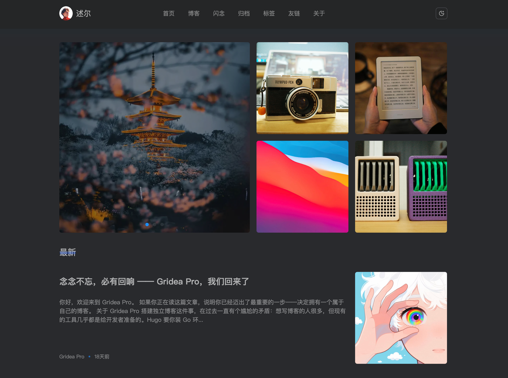

# Nacre

> 温柔、舒适、静谧的 Gridea Pro Jinja2 主题。默认深色底配柔和暖光，如珍珠母质在暗处静静生辉。

## 特性

- 🌙 **默认深色 · 暖光配色**：暗底加柔和色温，不刺眼也不冷清
- 🎠 **Swiper 头图**：首页头图轮播，支持自动切换间隔（按秒配置）、循环开关
- 🧱 **4 个特色块**：首页右侧 2×2 网格，开箱自带占位图。没配 featured 时头图自动撑满全宽
- 🏠 **动态导航**：config.logo / 头像+站点名 / 纯站点名三档回退；菜单原生支持 `menu.children` 展开二级下拉
- 💬 **闪念 · 动态分离**：`/memos/` 是 Gridea 原生闪念（站主自己）；首页"动态" Tab 是外部 Memos API 聚合（朋友圈）
- 🏷️ **归档按年分组** + 标签云侧栏 + 友链卡片页（支持静态友链 + fcircle 朋友圈文章流）
- 💡 **评论原生对接**：Gridea Pro `commentSetting`，Twikoo / Valine / Waline / Gitalk / Giscus / Disqus / Cusdis 全支持
- 🔢 **KaTeX 公式**：由 Gridea Pro 服务端 goldmark-katex 渲染，主题只加载 CSS，零 JS 开销
- 📐 **Sticky footer**：内容短也不会贴顶；banner 半宽 / 全宽自适应
- 📱 **响应式**：移动端汉堡菜单 + 侧栏抽屉

## 信息

| 字段 | 值 |
|---|---|
| 目录名 | `nacre` |
| 版本 | `1.0.0` |
| 模板引擎 | `jinja2` (Pongo2) |
| 基础 CSS | 基于 nuoea.com 的视觉语言再创作，原版 `style.css` 不动，主题补丁收敛在 `overrides.css` |

## 页面结构

| 页面 | 说明 |
|---|---|
| `index.html` | 首页：Swiper 头图 + 4 特色块 + 文章列表（带动态/摄影 Tab） |
| `post.html` | 文章详情（标题 / 日期 / 字数 / 标签 / 封面 / 正文 / 评论） |
| `archives.html` | 按年份分组的归档（+ 顶部分类特色卡） |
| `blog.html` | 纯文章列表（分页） |
| `tags.html` / `tag.html` | 标签云 / 单标签下的文章列表 |
| `about.html` | 关于页（圆形头像 + Gridea 原生 Markdown 内容） |
| `links.html` | 友链（Gridea 静态名单 + 可选的 fcircle 朋友圈文章流） |
| `memos.html` | 闪念（Gridea 原生 memos 卡片） |
| `404.html` | 错误页 |
| `album.html` / `goods.html` / `recent.html` | 外部聚合页（可选，需配 Memos API / NeoDB） |

## 主要配置

在 Gridea Pro 的"主题设置"里可配 47 个字段，按以下分组：

- **外观** — 默认暗色模式 / 导航栏头像 URL
- **首页** — Swiper 自动切换秒数 / 循环 / 4 个特色块的名称·链接·图片
- **基础** — 上一页 / 下一页 / 加载更多 文案
- **页脚** — 建站年份 / Powered by / ICP 备案号
- **社交** — GitHub / Twitter / 邮箱
- **闪念** — 卡片头像 / 作者名 / 默认标签
- **动态** — 外部 Memos API 根地址 / creatorId / 相册标签 / 好物标签 / 朋友圈 JSON / NeoDB
- **页面文案** — 各页标题、侧栏标签云标题、404 文案等
- **高级** — Umami 统计脚本 / 自定义 CSS / 自定义 JS

## 评论

不在主题配置里设。去 Gridea Pro 的"评论设置"选 provider 并填凭证，主题的 `post.html` 会根据 `commentSetting.commentPlatform` 自动分发到 7 个内置的 `comment-*.html` partial。

## 公式

不需要任何主题配置。文章里直接用 `$...$` / `$$...$$` / `\(...\)` / `\[...\]`，Gridea Pro 服务端 goldmark-katex 会渲染成 HTML，主题通过 CDN 加载 KaTeX CSS 让它显示出来。

## 致谢

视觉语言受 [nuoea.com](https://nuoea.com) 启发。CSS 结构 / iconfont / animate.css / Swiper / Lately 等第三方库保留原版，主题的再创作部分（模板 / 配置 / overrides.css）由我完成。
