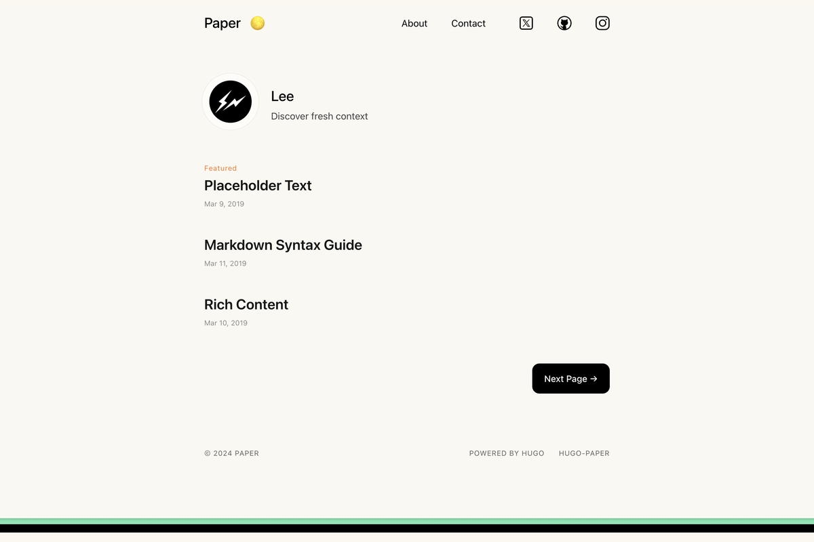

# Paper

> A simple, clean, flexible blog theme. Typography-focused, light/dark mode, Tailwind CSS. Jinja2 port of the Hugo [Paper](https://github.com/nanxiaobei/hugo-paper) theme by [@nanxiaobei](https://github.com/nanxiaobei).

## 特性

- 🎨 **极简排版**：大留白、居中主列，专注阅读体验
- 🌓 **暗色 / 亮色切换**：跟随系统、手动切换、偏好持久化
- 🎨 **4 种背景色主题**：linen / wheat / gray / light
- 👤 **首页个人卡片**：头像 + 作者名 + Bio，仅在第一页显示
- ⭐ **置顶文章 Featured 标记**：文章 `isTop = true` 时显示橙色 Featured
- 🏷️ **标签系统**：文章页底部标签云、`/tags/` 全部标签、`/tag/xxx/` 筛选
- 📅 **归档页**：按年份分组
- 💻 **highlight.js 代码高亮**（可选）
- 🔢 **KaTeX 数学公式**（可选）
- 📊 **Mermaid 图表**（可选）
- 📱 **完全响应式**：移动端自动切换到汉堡菜单

## 信息

| 字段 | 值 |
|---|---|
| 目录名 | `paper` |
| 版本 | `1.0.0` |
| 原作者 | [nanxiaobei](https://github.com/nanxiaobei) |
| Jinja2 移植 | Gridea Pro 社区 |
| 模板引擎 | `jinja2` (Pongo2) |
| CSS 框架 | Tailwind CSS 4（已编译） |
| 原版授权 | [MIT](https://github.com/nanxiaobei/hugo-paper/blob/main/LICENSE) |

## 页面结构

| 页面 | 说明 |
|---|---|
| `index.html` | 首页：第一页显示头像卡，往后翻页只显示文章列表 |
| `blog.html` | 纯文章列表（分页，不显示头像卡） |
| `archives.html` | 按年份分组的归档 |
| `post.html` | 文章详情（标题 / 日期 / 作者 / 内容 / 底部标签云） |
| `tag.html` | 单标签筛选，标题前缀 `#` |
| `tags.html` | 全部标签云 |
| `404.html` | 极简 404 |

## 自定义参数

在 Gridea Pro 应用「主题 → 自定义」里可以配置：

### 外观

- **背景色**：linen（亚麻白）/ wheat（浅麦黄）/ gray（淡灰）/ light（纯白）
- **默认暗色模式**：跟随系统 / 始终浅色 / 始终暗色
- **使用单色暗色切换图标**：关闭 = 原主题彩色 PNG 带动画；开启 = 单色 SVG

### 首页个人信息

- **作者名** / **作者 Bio** / **头像 URL**

### 社交链接（顶栏显示）

Twitter / GitHub / Instagram / LinkedIn / Mastodon / Threads / Bluesky / RSS

### 功能

- **启用代码高亮 (highlight.js)**（默认开启）
- **启用 KaTeX 数学公式**（默认关闭）
- **启用 Mermaid 图表**（默认关闭）
- **首页显示 Featured 标记**（默认开启）

### 站点图标

- **Favicon**

### 页脚

- **页脚版权文字**（留空则自动显示 © 年份 站点名）
- **页脚显示「Powered by」**

### 高级

- **自定义 CSS** / **自定义 JavaScript** / **分析代码（原样插入）**

## 跨引擎差异说明

本主题是 Hugo 原版的 **Jinja2 重写版**，核心外观 1:1 还原。主要差异：

- **模板引擎**：Go Template → Pongo2（Jinja2 的 Go 实现）
- **Tailwind CSS**：原版构建时用 PostCSS 编译；移植版直接内置已编译的 `main.css`（1841 行）
- **暗色切换**：图标（`theme.png` / `theme.svg`）、社交图标 SVG 等静态资源同步搬入 `assets/icons/`
- **移除的功能**：文章前后导航（`NextInSection` / `PrevInSection`，Gridea 无此字段）、Hugo i18n、Disqus / GraphComment / giscus（Gridea 有自己的评论系统）、多语言方向 rtl（中文场景暂不需要）
- **i18n**：原版支持多语言菜单；当前版本用中文硬编码（「上一页」「下一页」「归档」「标签」「暂无文章」等）

## 致谢

- 原版主题：[hugo-paper](https://github.com/nanxiaobei/hugo-paper) by [nanxiaobei (@南小北)](https://lee.so/)

## 授权

沿用原版的 **MIT** 授权。

## 问题反馈

在 [gridea-pro-themes](https://github.com/Gridea-Pro/gridea-pro-themes/issues) 提 Issue，选「主题 Bug」模板，主题名填 `paper`。
