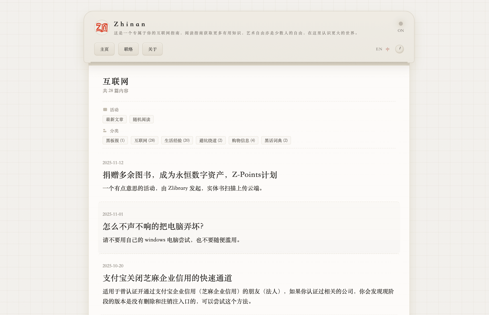

# Printer · 打印纸主题

> 仿打印机面板 / 网格纸 / 宋体衬线的复古博客主题。

## 这是什么

Printer 是为 [Gridea Pro](https://github.com/Gridea-Pro/gridea-pro) 移植的 Jinja2 (Pongo2) 主题。原作品是 zhinan（[zhinan.blog](https://zhinan.blog)）为 Typecho 写的 [Printer-Typecho](https://github.com/Ouxxxxxjoe/Printer-Typecho)，本仓库是独立 Jinja2 移植版。

适合：

- 喜欢复古 / 老派 / 排印感的写作者
- 想要"打开就是字"的阅读体验
- 不想被卡片图、动态色块打扰

## 主要特性

- **复古打印机面板顶栏**：米色渐变 + 圆角 + 投影 + 绿色 power 脉冲灯（暗黑模式变红）
- **网格纸背景**：SVG 直接画的方格线，不依赖图片
- **极简文章列表**：日期 + 标题 + 80 字摘要，无封面图
- **深 / 浅 / 跟随系统** 三态切换，带 FOUC 防护
- **阅读进度条**：长文（≥1.5 屏）才显示，避免短文有进度条干扰
- **估读时长**：按 200 字/分钟自动计算
- **全站搜索**：顶栏展开式 + `Cmd/Ctrl+K` 全屏弹窗（双轨）
- **闪念热力图**：GitHub 风格 365 天网格（原 Typecho 主题没有，按风格补的）
- **代码块复制 / 回到顶部**
- **评论挂载点**：复用 Gridea Pro 标准评论服务（Disqus / Gitalk / Waline / Twikoo …）

## 页面模板

| 模板 | 说明 |
|---|---|
| `index.html` | 首页：大标题 + 活动 / 分类元信息 + 文章列表 |
| `blog.html` | 博客列表（不含元信息卡片，纯列表 + 分页） |
| `post.html` | 文章详情：分类胶囊 + 日期/估读 + 大标题 + 正文 + 上下篇 + 评论 |
| `archives.html` | 按年份归档 + 数量统计 |
| `memos.html` | 闪念时间轴 + 热力图 |
| `tags.html` / `tag.html` | 标签云 / 单标签 |
| `categories.html` / `category.html` | 分类网格 / 单分类 |
| `links.html` | 友情链接卡片 |
| `about.html` | 关于页 |
| `404.html` | 错误页（含搜索框 + 分类入口） |

## 自定义参数（在 Gridea Pro 「主题设置」改）

- **基础**：Logo 文字 / 副标题 / 页脚版权 / 主题署名
- **外观**：主题色 / 外链强调色 / 字体（衬线 vs 无衬线）/ 默认配色
- **文章**：估读时长 / 阅读进度条 / 代码复制
- **搜索**：开关
- **闪念**：热力图 / 标题 / 描述
- **社交**：GitHub / Twitter / 微博 / RSS / Email
- **评论**：开关
- **高级**：访问统计代码 / Head 注入 / Footer 注入 / 自定义 CSS

完整字段见 [`config.json`](./config.json)。

## 资源约定

- `assets/styles/main.css` → `/styles/main.css`
- `assets/scripts/main.js` → `/scripts/main.js`
- `assets/media/images/*` → `/media/images/*`

## 关于"访问统计"

原 Typecho 版本走数据库 SQL 统计，Gridea Pro 是静态站，**不走那条路**。建议在「高级设置 → 访问统计代码」里粘贴 [不蒜子](https://busuanzi.ibruce.info/) / [Umami](https://umami.is/) / Plausible 的 `<script>`，主题会自动渲染到页脚。

## 致谢

设计 & 灵感：[zhinan](https://zhinan.blog)（[Printer-Typecho](https://github.com/Ouxxxxxjoe/Printer-Typecho)），原作品又复刻自 [NOOC](https://nooc.me/)。Gridea Pro Jinja2 移植由 Eric 完成。

## 授权

[MIT](./LICENSE)。
