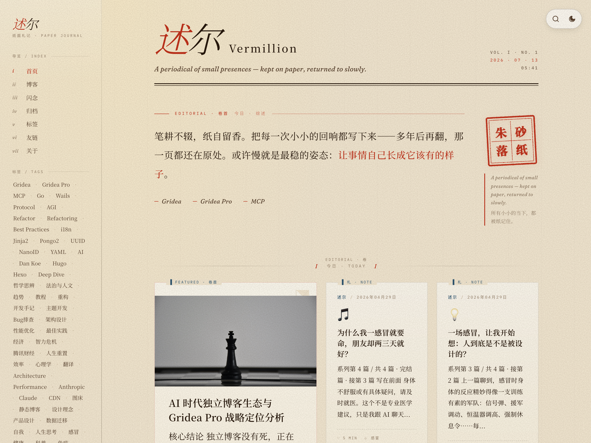

# Vermillion 朱砂 · Gridea Pro 主题

> 一抹朱砂落在宣纸上。

**vermillion** 是中式编辑美学的 Gridea Pro 原创博客主题（Jinja2 / Pongo2 引擎）：把博客排成一册纸面期刊——宣纸底色与纸面颗粒、期刊式刊头（卷号 / 期号 / 日期）、居中卷首语、一方可自定四字的朱砂印章，左侧是罗马数字目录与标签墙。

| 项 | 值 |
| - | - |
| 模板引擎 | Jinja2 (Pongo2) |
| 气质 | 中式编辑 / 纸面期刊 |
| 外观 | 明暗双模式（默认模式可配，可隐藏切换按钮） |
| 依赖 | 零框架、零构建，纯原生 HTML/CSS/JS |
| License | MIT |

## ✨ 特性

### 纸面期刊语言
- 📜 **期刊刊头**：品牌字（中文 + 英文 + 副标语）+ 卷号/期号 + 当日日期时间，像一份正在刊行的杂志
- ✍️ **卷首 EDITORIAL**：眉标 + 可配置卷首语 + 热门标签，右侧一方**朱砂印章**（四个字逐一可配，默认「朱砂落纸」）
- 🗞️ **今日 / 更早 分栏**：首页文章按「今日 TODAY」精选卡与「更早」列表分层，各自条数可配
- 🧭 **左侧目录 rail**：罗马数字 INDEX 导航 + TAGS 标签墙，常驻可扫读
- 🧻 **纸面颗粒纹理**（可关）：宣纸质感的噪点叠加

### 阅读体验
- 🌗 明暗双模式：默认模式可配，切换按钮可隐藏，记住访客选择
- 📑 文章目录（TOC）、阅读进度条、回到顶部、代码块一键复制——均独立开关
- 🔍 全站搜索 overlay（基于 `/api/search.json`）
- 🔥 闪念页发布热力图（可关）
- 💬 评论走 Gridea Pro 全局评论设置
- 📱 响应式布局

### 页面
首页（卷首 + 分栏列表）/ 博客 / 文章 / 归档 / 标签云 / 单标签 / 单分类 / 闪念 / 友链 / 关于 / 404。

## 🎛️ 主题设置

「主题设置」面板共 10 组 37 项：

| 组 | 内容 |
| - | - |
| 基础 | 品牌英文名、品牌后缀、副标题、副标语、卷号/期号 |
| 印章 | 印章四字（左上/右上/左下/右下） |
| 首页 | 卷首眉标/副眉/卷首语、「今日」「更早」条数、列表封面图 |
| 文章 | 目录、阅读进度条、回到顶部、代码复制 |
| 闪念 | 热力图开关 |
| 外观 | 默认模式、明暗切换按钮、纸面颗粒、全站搜索 |
| 社交 | GitHub / Twitter / 邮箱 / RSS |
| 页脚 | 标语、ICP 备案号、Powered by |
| 关于 / 增强 | 关于页备用文案、浏览统计脚本 |
| 高级 | 自定义 CSS、头部/底部注入代码 |

## 🛠️ 开发备忘

- 模板中 `post.date` 经引擎 JSON 上下文转换后是 **RFC3339 字符串**，不能使用 `|date:` 过滤器；展示日期用 `post.dateFormat`，相对时间用 `post.date|relative`。`now` 是真正的 `time.Time`。
- Pongo2 判断不等用 `x != y`（`not x == y` 会解析成 `(not x) == y`）。
- customConfig 的 `type` 只使用 GUI 实际支持的：`input` / `textarea` / `select` / `toggle` / `picture-upload`。
- Gridea Pro 引擎的 HtmlPostProcessor 会自动注入 SEO meta（description / OG / canonical / 文章 JSON-LD）；本主题的 head 另以 block 输出页面级 description / og:*（子模板可覆盖，更精准）。
