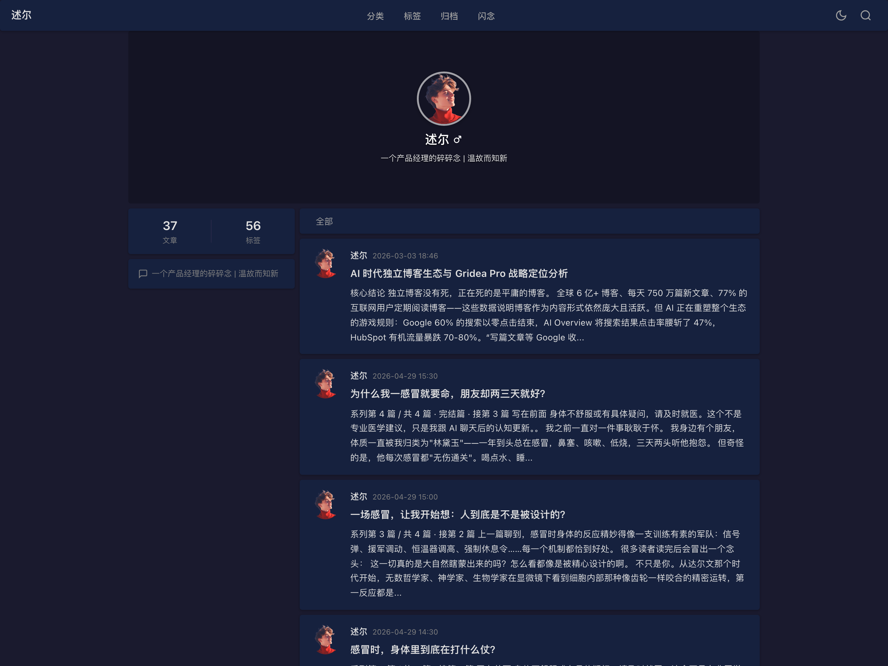

# Webinar · Gridea Pro 主题

> 把博客刷成一条微博时间线。

**webinar** 是微博风格的 Gridea Pro 微博客主题（Jinja2 / Pongo2 引擎），灵感来自 Sagittarius：顶部资料卡（背景图 + 圆头像 + 签名），左侧统计与信息侧栏，右侧是头像 + 昵称 + 时间 + 正文摘要的微博式卡片流——每篇文章都像一条动态。

| 项 | 值 |
| - | - |
| 模板引擎 | Jinja2 (Pongo2) |
| 气质 | 微博 / 动态流 |
| 外观 | 明暗双模式（默认模式可配） |
| 依赖 | 零框架、零构建，纯原生 HTML/CSS/JS |
| License | MIT |

## ✨ 特性

- 📱 **微博式卡片流**：头像 + 昵称 + 日期 + 标题 + 正文摘要，首页 / 博客 / 标签 / 分类列表统一动态样式
- 🪪 **顶部资料卡**：背景图、圆形头像、性别符号、签名均可配置
- 📊 **统计侧栏**：文章数（取自全站索引）+ 标签数，附站点简介与邮箱
- 🌗 明暗双模式切换，记住访客选择
- 🔥 闪念页：动态流 + 发布热力图（主色可配）
- 🔍 全站搜索（基于 `/api/search.json`）
- 🎨 背景模式可选纯色 / 图片，主题色、热力图色自由配置
- 📄 页面齐全：首页 / 博客 / 文章 / 归档 / 标签云 / 单标签 / 单分类 / 闪念 / 友链 / 关于 / 404

## 🎛️ 主题设置

「主题设置」面板共 17 项：站点 Logo、头像源、背景模式 / 图片 / 颜色、资料卡背景图 / 头像 / 性别、统计开关、搜索、热力图、默认主题、主题色、热力图主色、页脚信息、自定义 CSS / JS。

> 评论：Gridea Pro 的评论走全局评论平台设置（`commentSetting`），主题内原 Typecho 式内置评论 UI 因无数据源已停用，待后续接入平台评论。

## 🛠️ 开发备忘

2026-07 收拾入库时按真实渲染修复的坑（多为 Typecho 移植残留，供后来者参考）：

- **pongo2 的 `or` 是布尔运算**：`{{ a or b or 'x' }}` 输出 `True`/`False` 而不是取值——头像 src 曾全站变成 `"True"`。取值链要写 `{{ a }}{{ b }}x`。
- `post.excerpt` / `stats.*` / `categories` / `recentComments` / `page.content` / `config.siteUrl` / `pagination.pages` 均**不是** Gridea Pro 的上下文变量，取值静默为空。摘要用 `post.description` 或 `post.content|excerpt:N|strip_html|safe`（`|safe` 防止残留 HTML 实体二次转义）；about 页正文在 `post` 变量；分页用 `hasPrev/hasNext/prevURL/nextURL`。
- `post.content` / `memo.content` 是 HTML，输出必须 `|safe`，否则读者看到的是源码。
- 展示日期用 `post.dateFormat` / `memo.createdAt`；`post.date` 是 RFC3339 字符串，只放 `datetime` 属性。
