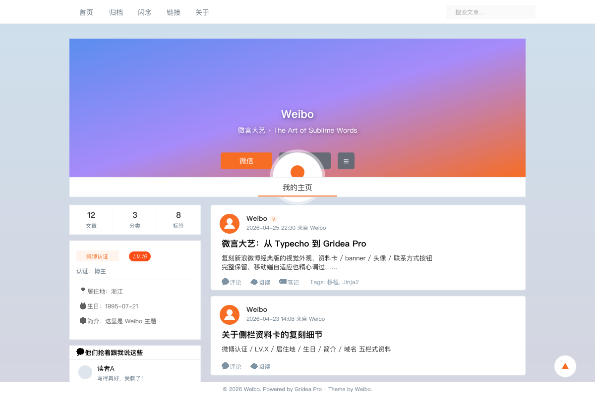

# Weibo — Gridea Pro 主题

> **微言大艺 · The Art of Sublime Words**
>
> 从 Typecho 主题 [PomeloOfficial/Weibo](https://github.com/PomeloOfficial/Weibo)（作者 Pomelo）100% 视觉移植到 Gridea Pro 的 Jinja2 主题。高仿新浪微博经典版的资料卡 + 信息流体验。



## 特点

- **高仿微博经典版** —— 蓝灰底纹 + 白色信息流卡片 + 280px Banner 资料卡 + 圆形头像 + 橙色 `#f76d24` 招牌色
- **资料卡 Banner** —— 昵称 / 微博认证 / VIP 等级 / 一句话简介 / 联系方式按钮（微信二维码 hover + QQ 链接）
- **微博式侧栏** —— 文章/分类/标签三栏数字 + 资料卡详情（认证 LV / 居住地 / 生日 / 简介 / 域名）+ 热门标签 + 「他们抢着跟我说这些」+ 「左邻右舍」友链
- **深浅模式** —— 跟随系统 / 始终亮 / 始终暗 / 由读者切换 4 档；防闪暗色内联脚本
- **全屏搜索** —— 直接 fetch `/api/search.json`，标题 ×5 / 标签 ×3 / 正文 ×1 加权评分；快捷键 `/` 或 `Ctrl+K`
- **闪念页 + 热力图** —— 53 周 × 7 天发布密度可视化，5 档橙色配色（`--wb-heat-0..4`）
- **响应式** —— PC 双栏（侧栏 + 信息流），≤ 900px 切移动单栏 + 顶栏汉堡 / 搜索 / 主题切换三键
- **iconfont** —— 沿用原主题字体图标（eot/ttf/woff 全本地化，无 CDN）
- **上下篇导航** —— 用 Gridea Pro 标准 `post.prevPost / nextPost`
- **评论组件** —— 标准 `#gridea-comments` 挂载点
- **返回顶部** —— 右下浮动 ▲

## 页面与组件

页面：首页 / 博客列表 / 文章详情 / 归档 / 闪念 / 标签列表 / 标签详情 / 分类列表 / 分类详情 / 友链 / 关于 / 404

组件：Banner 资料卡 / 头像 / 侧栏 widgets（统计 + 资料 + 热门标签 + 最近评论 + 友链）/ 搜索 modal / 分页 / 上下篇 / memos 热力图 / 评论挂载点 / 面包屑 / 返回顶部

## 关键自定义配置项（节选）

通过 Gridea Pro 客户端的「主题设置」面板配置，共 33 项分 7 组：

| 分组 | 关键项 |
|------|--------|
| 资料卡 | 昵称 / 简介 / 头像 URL / 页面背景图 / Banner 背景图 / 居住地 / 生日 / 微博认证文案 / 用户等级 |
| 联系方式 | 按钮 1（微信，hover 显示二维码图）/ 按钮 2（QQ，链接） |
| 外观 | 深浅模式 4 档 / 显示明暗切换按钮 / 主色（招牌橙）/ 容器最大宽度 / 返回顶部 |
| 首页 | 摘要字数 / 显示大图 / 面包屑 |
| 侧栏 | 三栏统计 / 资料卡详情 / 最近评论 widget / 友链 widget |
| 闪念 | 标题 / 显示热力图 |
| 页脚 | 附加文案 / ICP / Powered by |
| 高级 | 自定义 CSS / head HTML / body 末尾 HTML |

## 移植要点（与原 Typecho 版的差异）

| 原行为 | Gridea Pro 移植 |
|--------|----------------|
| Pjax + Ajax 翻页 | 砍，纯静态 + 标准上一页/下一页 |
| Typecho 评论表单 | 替换为 `#gridea-comments` 标准挂载点 |
| 搜索（form 提交后端） | fetch `/api/search.json` 客户端高亮 |
| 缩略图调用文章第 N 张图 | 用 `post.feature`，无则使用默认封面 SVG |
| 阅读量 SQL | 留 `#busuanzi_value_page_pv` 占位 + 不蒜子开关 |
| 最近评论 widget（按 DB） | 占位容器 + 由全局评论组件客户端注入 |
| 文章目录 | 用 `post.toc \| safe` |
| 暗色模式 | **新增**——原主题无，按其配色补一套 token |
| 闪念 + 热力图 | **新增**——Gridea 标准 `memos.html` + 53×7 热力图 |

## 开发与验证

```bash
# 语法验证
python scripts/validate_syntax.py themes/weibo

# 渲染测试
python scripts/render_test.py themes/weibo
```

当前状态：**0 错误 / 13 模板 全部 PASS**（3 个 `.content` 链尾警告为已知假阳性，与 initial / cactus 同款）。

## 致谢与许可

- 原 Typecho 主题灵感来源：[PomeloOfficial/Weibo](https://github.com/PomeloOfficial/Weibo)（作者 Pomelo）
- 本 Gridea Pro 移植版采用 MIT 协议（与本仓库其他主题一致）

如发现 BUG 或希望追加功能，请在 [Gridea-Pro/gridea-pro-themes](https://github.com/Gridea-Pro/gridea-pro-themes) 提 Issue 或 PR。
